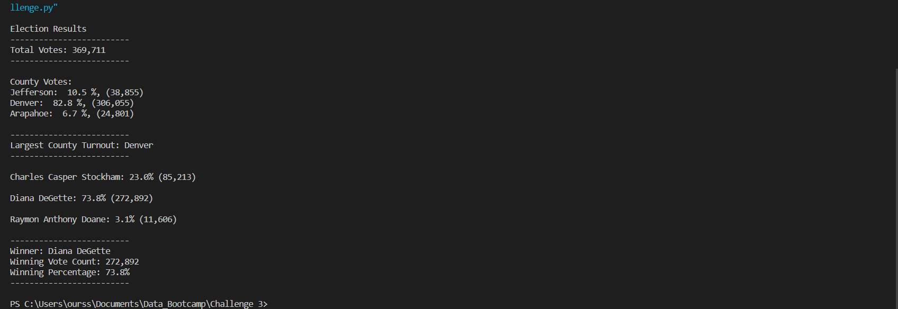
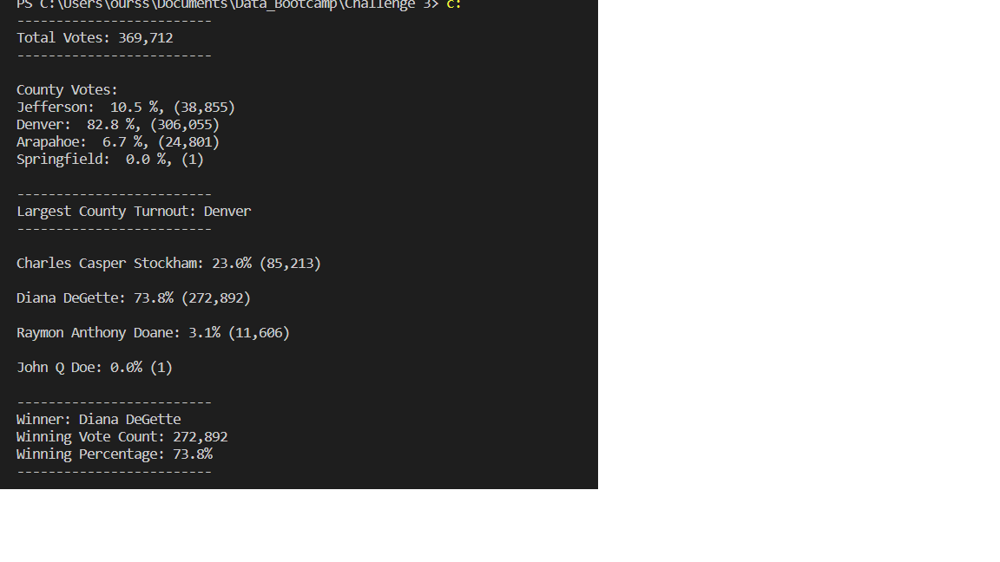
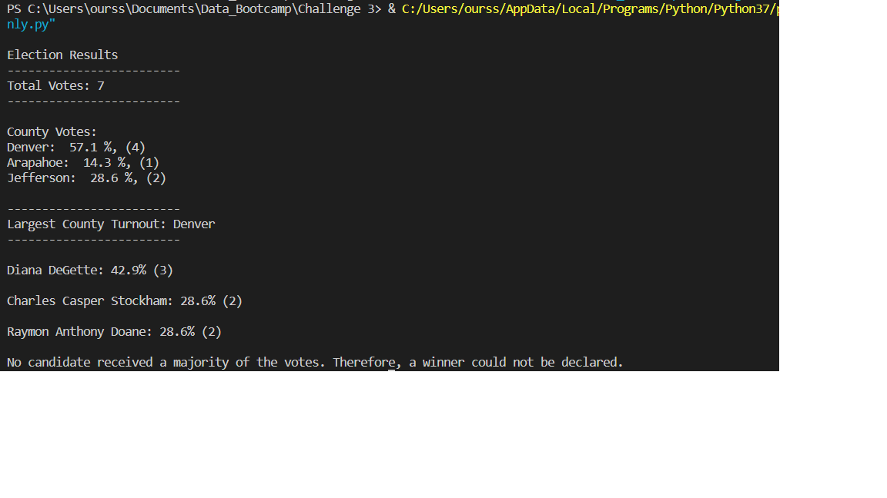

# PyPoll – Election Audit and Analysis
## Overview of Project
### Purpose and Background
This project was setup in the context of assisting a board of elections member with the task of compiling information about votes that came in from a district[^1] in Colorado, in order to perform an audit of the original vote counts for the purpose of certifying the results. [The votes were presented in a CSV format](Resources/election_results.csv),  which had to be read to determine the information requested. Particularly, the board wanted to know the number of votes cast in each county within the district, the total number of votes cast the name of every candidate who received at least one vote, the number and percentage of votes received by each candidate, and the winning candidate by popular vote. Additionally, it was requested that the results be saved from the script as [a text file.](analysis/election_results.txt) The votes numbered in the hundreds of thousands, making it necessary to write a Python script to automate the task. The ultimate objective here was not only to accurately report the results of this election, but also to create a program in Python that could report the same data about a different election, if given a new CSV file with the relevant data. This way, the same program could be used to audit a variety of different elections.
[^1]: The module materials used the word “precinct” here, but a precinct is usually a subsection of a county, and a member of Congress is generally determined by a combination of many precincts. Here, we had multiple counties involved, and declared a winner of a Congressional race, which suggests that the entity being represented is more likely a Congressional district.

## Results
### Election-Audit Results
By running the script, the following output was produced in the terminal.  It was found that:
-	369,711 total votes were cast in the district.
-	Jefferson county cast 38,855 votes, comprising 10.5% of the total. Denver county cast 306,055 votes, comprising 82.8% of the total.  Arapahoe county cast 24,801 votes, which accounted for the remaining 6.7% of the total.
-	Denver County cast the greatest number of votes in this district, with a total of 306,055.
-	Three candidates received votes in the district. Charles Casper Stockham received 23% of the votes, with a total of 85,213. Diana DeGette had 73.8% of the votes, with a total of 272,892. Raymon Anthony Doane received 3.1% of the vote, with 11,606 votes.
-	Diana DeGette won the election, with 272,892 total votes. This was 73.8% of the total votes cast.

## Summary
### Election-Audit Summary
The advantages of using the script over manual counting are clear, in that it is much less time-consuming, and not prone to human error. Additionally, the output summary is much easier to read in the text format rather than placing summary rows into an already crowded spreadsheet. Because the script compiles the lists of candidates and counties wile reading the vote file, it can adapt to different lists of candidates or counties simply by reading a different CSV file. For example, if we add the following entry to election_results.csv:
```
99,	Springfield,	John Q Doe
```
Then the script’s output will reflect the addition of the new candidate and the new county, like so:

Additionally, a conditional statement could be included to account for election formats in which the winning candidate is required to have a majority of votes rather than a plurality by adding this block of code:
```
 winning_candidate_summary = (
        f"-------------------------\n"
        f"Winner: {winning_candidate}\n"
        f"Winning Vote Count: {winning_count:,}\n"
        f"Winning Percentage: {winning_percentage:.1f}%\n"
        f"-------------------------\n")
    no_winner_summary = (f"No candidate received a majority of the votes. Therefore, a winner could not be declared.")
    if (winning_percentage >50):
        print(winning_candidate_summary)
    else:
        print (no_winner_summary)
```

Running the script on a [hypothetical set in which there was no majority](resources/no_majority.csv) then produces the following output: 
